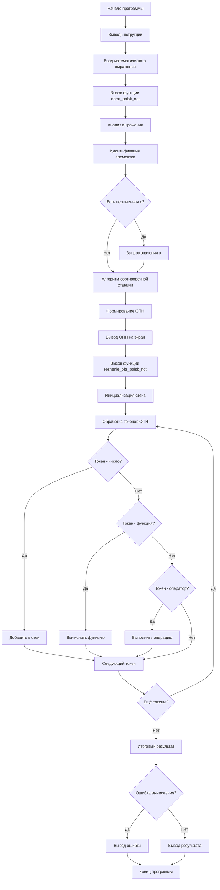

# Отчет к домашнему заданию №3 "Создание консольного калькулятора"

## Цели:

- Разработать программу-калькулятор для вычисления математических выражений, которые вводит пользователь.
- Реализовать алгоритм для перевода арифметических выражений из обыкновенной записи в обратную польскую нотацию.
- Разработать алгоритм для вычисления значений с помощью различных операторов и функций.
- Создать понятный интерфейс для взаимодействия с пользователем.

## Задачи работы:

- Реализовать разбор математических выражений на отдельные составляющие.
- Разработать алгоритм преобразования инфиксной записи в обратную польскую нотацию.
- Реализовать алгоритм для вычисления значения выражения в обратной польской нотации.
- Реализовать корректную обработку всех компонентов арифметического выражений (чисел, констант, переменных, операторов, функций, скобок).

## Теоретическая база:

- Обратная польская нотация (Reverse Polish Notation - RPN) — математическая нотация, в которой операторы записываются после операндов. В отличие от традиционной инфиксной -нотации, где операторы записываются между операндами (например, 5+8), в RPN выражение будет представлено в виде 5 8 +

## Преимущества RPN:

- Устраняет необходимость в скобках для определения приоритета операций.
- Позволяет реализовать алгоритм для вычисления с использованием стека.
- Исключает неоднозначность в порядке выполнения арифметических операций.
- Удобна в реализации на языке программирования c++.

## Описание принципа работы:

- Программа начинает работу с приветственного сообщения, информирующего пользователя о поддерживаемых операциях. После ввода выражения происходит его посимвольный анализ — -проход по всем символам строки с идентификацией этих элементов (числа, операторы, функции, скобки, переменные).

- Затем выполняется преобразование в постфиксную нотацию с помощью алгоритма сортировочной станции, использующего стек для временного хранения операторов.

- Если в выражении обнаружена переменная X, программа запрашивает ее значение у пользователя. Финальный этап - вычисление результата путем обработки обратной польской нотации записи с использованием стека для промежуточных результатов.

- Программа поддерживает следующие элементы выражений:

- Базовые арифметические операции (+, -, *, /)
- Математические функции (sin, cos, tg, ctg, exp)
- Константы (PI, E)
- Переменную X
- Унарный минус и скобки для задания приоритета

## Продемонстрируем принцип работы программы с помощью блок-схемы ниже:

- В ходе работы был успешно разработан консольный калькулятор, способный обрабатывать сложные математические выражения. Программа использует эффективные алгоритмы обработки математических выражений.

- Реализованная программа корректно обрабатывает приоритеты операций, унарные операции, математические функции и переменные.
